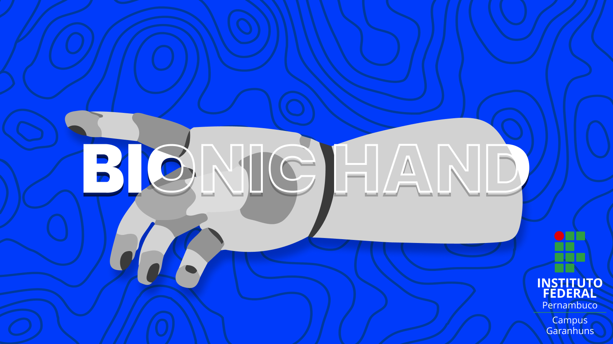

  

<h3 align="center">Bionic Hand</h3>

[![PLATFORMIO](https://img.shields.io/static/v1?style=for-the-badge&message=PlatformIO&color=orange&logo=data%3Aimage%2Fsvg%2Bxml%3Bbase64%2CPHN2ZyB3aWR0aD0iMjUwMCIgaGVpZ2h0PSIyNTAwIiB2aWV3Qm94PSIwIDAgMjU2IDI1NiIgeG1sbnM9Imh0dHA6Ly93d3cudzMub3JnLzIwMDAvc3ZnIiBwcmVzZXJ2ZUFzcGVjdFJhdGlvPSJ4TWlkWU1pZCI+PHBhdGggZD0iTTEyOCAwQzkzLjgxIDAgNjEuNjY2IDEzLjMxNCAzNy40OSAzNy40OSAxMy4zMTQgNjEuNjY2IDAgOTMuODEgMCAxMjhjMCAzNC4xOSAxMy4zMTQgNjYuMzM0IDM3LjQ5IDkwLjUxQzYxLjY2NiAyNDIuNjg2IDkzLjgxIDI1NiAxMjggMjU2YzM0LjE5IDAgNjYuMzM0LTEzLjMxNCA5MC41MS0zNy40OUMyNDIuNjg2IDE5NC4zMzQgMjU2IDE2Mi4xOSAyNTYgMTI4YzAtMzQuMTktMTMuMzE0LTY2LjMzNC0zNy40OS05MC41MUMxOTQuMzM0IDEzLjMxNCAxNjIuMTkgMCAxMjggMCIgZmlsbD0iI0ZGN0YwMCIvPjxwYXRoIGQ9Ik0yNDkuMzg2IDEyOGMwIDY3LjA0LTU0LjM0NyAxMjEuMzg2LTEyMS4zODYgMTIxLjM4NkM2MC45NiAyNDkuMzg2IDYuNjEzIDE5NS4wNCA2LjYxMyAxMjggNi42MTMgNjAuOTYgNjAuOTYgNi42MTQgMTI4IDYuNjE0YzY3LjA0IDAgMTIxLjM4NiA1NC4zNDYgMTIxLjM4NiAxMjEuMzg2IiBmaWxsPSIjRkZGIi8+PHBhdGggZD0iTTE2MC44NjkgNzQuMDYybDUuMTQ1LTE4LjUzN2M1LjI2NC0uNDcgOS4zOTItNC44ODYgOS4zOTItMTAuMjczIDAtNS43LTQuNjItMTAuMzItMTAuMzItMTAuMzJzLTEwLjMyIDQuNjItMTAuMzIgMTAuMzJjMCAzLjc1NSAyLjAxMyA3LjAzIDUuMDEgOC44MzdsLTUuMDUgMTguMTk1Yy0xNC40MzctMy42Ny0yNi42MjUtMy4zOS0yNi42MjUtMy4zOWwtMi4yNTggMS4wMXYxNDAuODcybDIuMjU4Ljc1M2MxMy42MTQgMCA3My4xNzctNDEuMTMzIDczLjMyMy04NS4yNyAwLTMxLjYyNC0yMS4wMjMtNDUuODI1LTQwLjU1NS01Mi4xOTd6TTE0Ni41MyAxNjQuOGMtMTEuNjE3LTE4LjU1Ny02LjcwNi02MS43NTEgMjMuNjQzLTY3LjkyNSA4LjMyLTEuMzMzIDE4LjUwOSA0LjEzNCAyMS41MSAxNi4yNzkgNy41ODIgMjUuNzY2LTM3LjAxNSA2MS44NDUtNDUuMTUzIDUxLjY0NnptMTguMjE2LTM5Ljc1MmE5LjM5OSA5LjM5OSAwIDAgMC05LjM5OSA5LjM5OSA5LjM5OSA5LjM5OSAwIDAgMCA5LjQgOS4zOTkgOS4zOTkgOS4zOTkgMCAwIDAgOS4zOTgtOS40IDkuMzk5IDkuMzk5IDAgMCAwLTkuMzk5LTkuMzk4em0yLjgxIDguNjcyYTIuMzc0IDIuMzc0IDAgMSAxIDAtNC43NDkgMi4zNzQgMi4zNzQgMCAwIDEgMCA0Ljc0OXoiIGZpbGw9IiNFNTcyMDAiLz48cGF0aCBkPSJNMTAxLjM3MSA3Mi43MDlsLTUuMDIzLTE4LjkwMWMyLjg3NC0xLjgzMiA0Ljc4Ni01LjA0IDQuNzg2LTguNzAxIDAtNS43LTQuNjItMTAuMzItMTAuMzItMTAuMzItNS42OTkgMC0xMC4zMTkgNC42Mi0xMC4zMTkgMTAuMzIgMCA1LjY4MiA0LjU5MiAxMC4yODkgMTAuMjY3IDEwLjMxN0w5NS44IDc0LjM3OGMtMTkuNjA5IDYuNTEtNDAuODg1IDIwLjc0Mi00MC44ODUgNTEuODguNDM2IDQ1LjAxIDU5LjU3MiA4NS4yNjcgNzMuMTg2IDg1LjI2N1Y2OC44OTJzLTEyLjI1Mi0uMDYyLTI2LjcyOSAzLjgxN3ptMTAuMzk1IDkyLjA5Yy04LjEzOCAxMC4yLTUyLjczNS0yNS44OC00NS4xNTQtNTEuNjQ1IDMuMDAyLTEyLjE0NSAxMy4xOS0xNy42MTIgMjEuNTExLTE2LjI4IDMwLjM1IDYuMTc1IDM1LjI2IDQ5LjM2OSAyMy42NDMgNjcuOTI2em0tMTguODItMzkuNDZhOS4zOTkgOS4zOTkgMCAwIDAtOS4zOTkgOS4zOTggOS4zOTkgOS4zOTkgMCAwIDAgOS40IDkuNCA5LjM5OSA5LjM5OSAwIDAgMCA5LjM5OC05LjQgOS4zOTkgOS4zOTkgMCAwIDAtOS4zOTktOS4zOTl6bS0yLjgxIDguNjcxYTIuMzc0IDIuMzc0IDAgMSAxIDAtNC43NDggMi4zNzQgMi4zNzQgMCAwIDEgMCA0Ljc0OHoiIGZpbGw9IiNGRjdGMDAiLz48L3N2Zz4=&logoColor=FFFFFF&label=)](https://platformio.org)

---

This project aims to design a prosthetic hand that can simulate the movement of a hand using microcontrollers. It is designed to provide a basic simulation of hand movements. The project was developed as part of the National Science and Technology Week (SNCT) and the Art and Culture Week (SEMAC) at IFPE - Garanhuns campus.  

## 📝 Table of Contents
- [🧐 Problem Statement](#problem_statement)
- [💡 Idea / Solution](#idea)
- [⛓️ Dependencies / Limitations](#limitations)
- [🚀 Future Scope](#future_scope)
- [🏁 Getting Started](#getting_started)
- [🎈 Usage](#usage)
- [⛏️ Technology Stack](#tech_stack)
- [Contributing](../CONTRIBUTING.md)
- [✍️ Authors](#authors)
- [🎉 Acknowledgments](#acknowledgments)

## 🧐 Problem Statement 
The Bionic Hand project aims to develop a fully functional prosthetic hand that can mimic the movements of a real human hand. The main challenge is to design a system that allows intuitive control and precise movements of the hand, enabling users to perform daily tasks with ease and naturalness.

## 💡 Idea / Solution 
The Bionic Hand project proposes a solution where the prosthetic hand is controlled through a website interface. The website is built using HTML, CSS, and JavaScript, providing a user-friendly interface for commanding the hand movements. By interacting with the controls on the website, users can control the opening and closing of the hand, as well as the rotation and movement of individual fingers.

## ⛓️ Dependencies / Limitations 
#### The Bionic Hand project depends on the following components and technologies:
- **ESP32 Microcontroller:** It acts as the central control unit for the prosthetic hand, receiving commands from the website and translating them into actions for the servo motors.
- **5 x MG996R Servo Motors:** These motors are responsible for controlling the movement of the fingers.
- **PCA9685 Servo Motor Controller Board:** This board is used to control and manage the multiple servo motors connected to the microcontroller.
- **3D Printed Arm:** The physical structure of the arm is fabricated using 3D printing technology, ensuring a lightweight and customizable design.
- **Power Source:** A reliable power source, such as batteries or an AC adapter, is required to power the microcontroller and servo motors.

#### The limitations of the project include:
- The range of motion of the prosthetic hand may be limited compared to a natural human hand due to mechanical constraints of the servo motors.
- The prosthetic hand may not provide sensory feedback to the user, such as touch or pressure sensitivity.
- The precision of controlling hand movements can be influenced by the accuracy and calibration of the servo motors.

## 🚀 Future Scope 
The Bionic Hand project has promising future prospects, including:
- Increasing the range of motion of the prosthetic hand to closely mimic the movements of a human hand.
- Incorporating advanced sensors to provide sensory feedback to users, such as temperature and pressure detection.
- Integrating machine learning algorithms to allow the hand to learn and adapt to the specific needs and preferences of the user.

## 🏁 Getting Started 
### Prerequisites
- [Visual Studio Code](https://code.visualstudio.com)
- [PlatformIO](https://platformio.org/install/ide?install=vscode)
- ESP32 microcontroller

### Installing
1. 

## 🎈 Usage 
To control the Bionic Hand, follow these steps:

Make sure the microcontroller and servo motors are properly connected and powered.
Open the website interface in your preferred web browser.
Use the controls on the website to send hand movement commands, such as open, close, rotate the hand, and bend individual fingers.

## ⛏️ Technologies Used 

- ESP32 Microcontroller
- Arduino framework
- PlatformIO

The Bionic Hand project utilizes the following technologies and components:

- [ESP32]() - Microcontroller
- [PlatformIO]() -
- [HTML, CSS, and JavaScript]() - for the website interface
- [MG996R]() - Servo Motors
- [PCA9685]() - Servo Motor Controller Board
- [3D Printing]() - arm structure

## ✍️ Authors 
- [@Andrey Henrique]()
- [@Elton Martins]()
- [@Endrews Dias]()
- [@Iago Gomes]()
- [@João Augusto]()
- [@Kayque de Oliveira]()
- [@Marcos Helbert](https://github.com/MarcosHADM)
- [@Ricardo Marinho]()
- [@Ruan Severo]()
- [@Vinicius Rodrigues]()

See also the list of [contributors](https://github.com/MarcosHADM/HANDEASE/contributors)
who participated in this project.

## 🎉 Acknowledgments 
The Bionic Hand project would like to acknowledge the following:

- The SNCT for providing the opportunity to work on this project.
- The open-source community for providing valuable resources and support.
- The users and testers of the Bionic Hand project for their feedback and suggestions.

- Hat tip to anyone whose code was used
- Inspiration
- References
